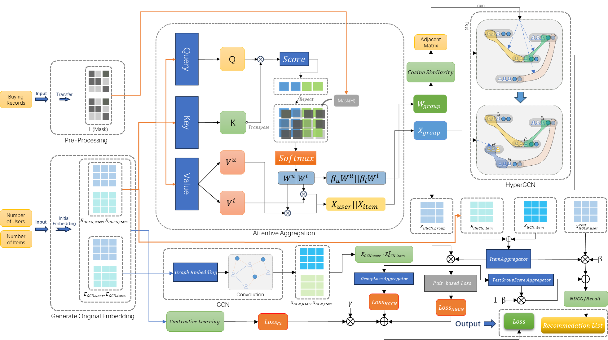
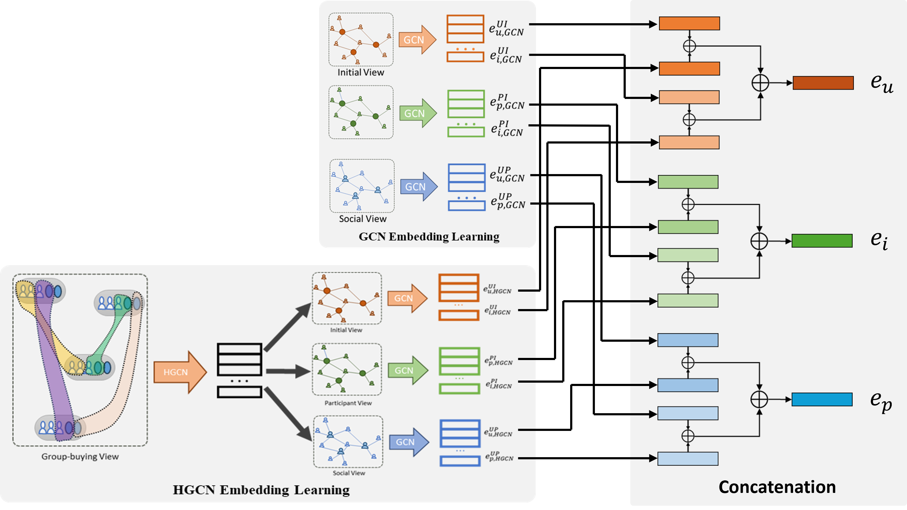
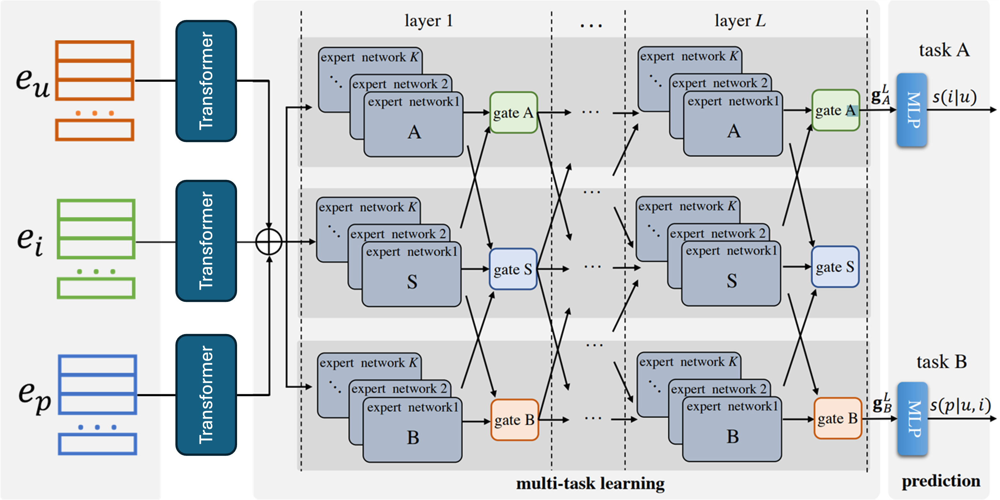

# HyperGCNv1.0

### Overview


# HyperGCNv2.1

### Overview



## Requirements
The code has been tested running under Python 3.9 with the following packages installed (along with their dependencies):

```
torch>=1.13.0
dgl>=1.1.0
```
To guarantee that you have the right package versions, you can use Anaconda to set up a virtual environment and install the above packages.

## Train and test
python hypermotif\model\HGCN.py

## License
This project is licensed under the MIT License. See the [LICENSE](./LICENSE) file for details.

## 📫 Contact
For any inquiries or collaboration opportunities, feel free to reach out to me at [yj2012@hw.ac.uk](yj2012@hw.ac.uk).

## Project is updating
